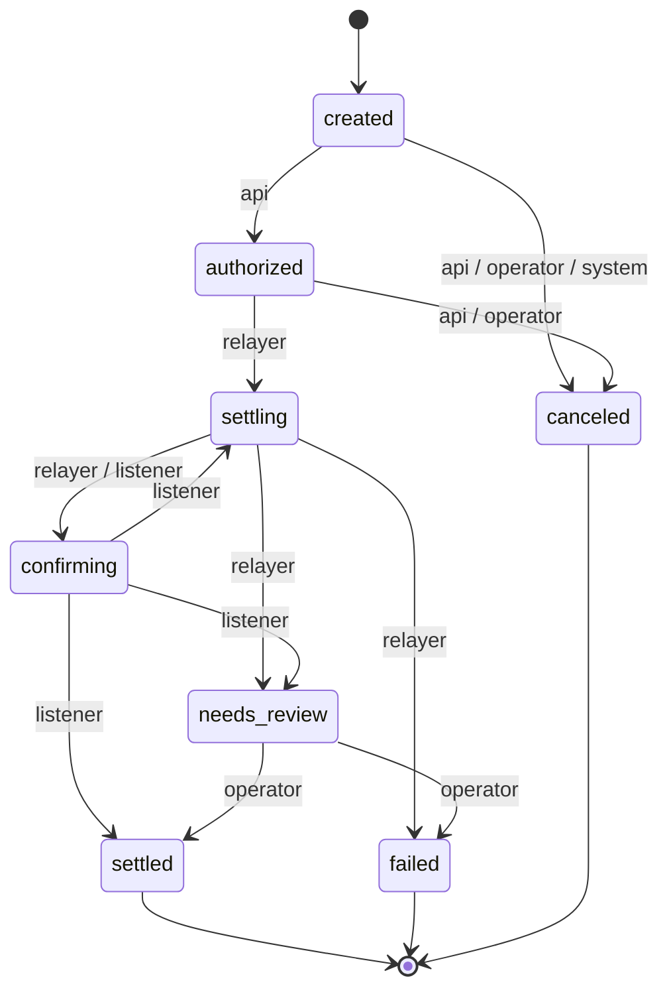
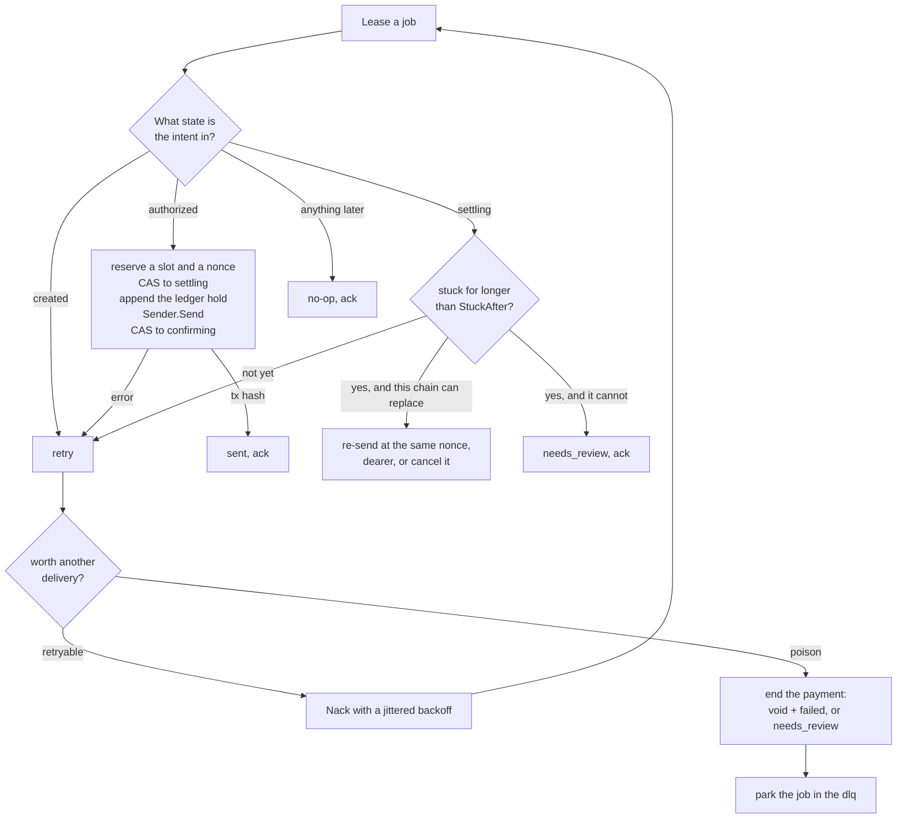

# stablecoin-settlement-engine

> **Move money exactly once.** A multichain stablecoin settlement engine.

A monorepo: the EVM contracts and the local devnet tooling under `contracts/`, the Go off-chain side
under `backend/`. Everything is organised around one invariant — a payment moves money at most once,
however many times a job is redelivered, a worker dies mid-flight, or an RPC call times out without
saying what it did. Every step is idempotent, every state change is a compare-and-swap, and anything
the engine cannot decide safely goes to a person instead of being guessed at.

**What exists today**

- **On-chain** — EVM contracts, a mock token zoo that reproduces real ERC-20 misbehaviour
  (no return value, approve races, transfer fees, blacklists), a one-command local devnet, and
  mainnet-fork tests that check the mocks against the real thing.
- **Payment core** — the Payment Intent state machine with a pinned transition table and a CAS store,
  the PaymentRef commitment, and an append-only hash-chained double-entry ledger.
- **Delivery** — an at-least-once job queue, a relayer worker pool with graceful drain and a throttle,
  one nonce line per sending account, fee-bumped replacement for stuck transactions, and a retry
  policy that ends in a dead-letter store an operator can redrive from.
- **HTTP** — `POST /v1/payment_intents` behind an Idempotency-Key layer, plus lookup by intent id and
  by ref.

The sender itself is still a fake; the real chain senders and the non-EVM chains land in their own
directories as the series progresses.

## Quick start

Requires [Foundry](https://getfoundry.sh) >= 1.3.0 (`anvil_dealERC20` was added there), `jq`, and
[Go](https://go.dev/dl/) >= 1.24 for `backend/`.

```bash
curl -L https://foundry.paradigm.xyz | bash && foundryup   # if you do not have Foundry yet
```

```bash
git clone https://github.com/RainBoltz/stablecoin-settlement-engine && cd stablecoin-settlement-engine
git submodule update --init --recursive     # forge-std is a git submodule
make test                                   # everything that runs offline: evm-test + go-test
```

`make test` needs no chain, no keys and no RPC endpoint.

The quickest way to see what the engine actually does is to let it narrate itself. Every package
ships runnable examples whose expected output is pinned by the test suite, so they cannot drift:

```bash
cd backend && go test ./internal/... -run Example -v
```

### Make targets

| Target | What it does |
| --- | --- |
| `make test` | everything that runs offline: `evm-test` + `go-test` |
| `make evm-build` | compile `contracts/evm` |
| `make evm-test` | the Solidity suite; the mainnet-fork tests are skipped |
| `make evm-test-fork` | the mainnet-fork faithfulness tests; needs `ETH_RPC_URL` |
| `make go-test` | `go vet` + `go test` for `backend/` |
| `make api-run` | the Payment API on `http://127.0.0.1:8080`, memory stores, no chain |
| `make devnet` | start anvil, deploy the Token Zoo, seed balances; state persists in `.devnet/` |
| `make devnet-status` | who has what |
| `make devnet-seed` | redeploy and reseed against the running anvil |
| `make devnet-logs` | tail the anvil log |
| `make devnet-down` | stop anvil (state is dumped to `.devnet/anvil-state.json`) |
| `make devnet-reset` | wipe state and deployments; the next `make devnet` starts from genesis |

Deployed addresses land in `contracts/evm/deployments/31337.json`. To run the mainnet-fork
faithfulness tests: `ETH_RPC_URL=https://... make evm-test-fork`. Useful variants: `forge test -vvvv`
inside `contracts/evm` to see full call traces, and `forge fmt` before committing.

### Calling the API

The Payment API requires `Authorization: Bearer <token>` (the token is the idempotency scope; there is
no real authentication yet) and an `Idempotency-Key` header on every `POST`. Same key + same body replays
the first answer with `Idempotent-Replayed: true`; same key + different body is a `422`; a retry that
lands while the first request is still running is a `409`. Keys live 24 hours.
`Example_retryStorm` and `Example_traceByRef` (`internal/api/example_test.go`) walk through the retry storm
and a trace-by-ref end to end; `go test ./internal/api -run Example -v` runs them.

## How a payment moves

### The Payment Intent state machine

One intent, one row, one state. Every transition names the actor allowed to make it — `api`,
`relayer`, `listener`, `operator` or `system` — and most also demand evidence, a `tx_hash` or a
`reason` or both, so no state change lands without saying who did it and why.



`settled`, `failed` and `canceled` are absorbing; `needs_review` is the escape hatch, and only an
operator gets out of it. Replaying a transition that already happened is a no-op, which is what makes
redelivery safe everywhere else.

The table is pinned by `backend/internal/intent/testdata/transitions.golden`; to change a rule, edit
`Rules()` and regenerate with `cd backend && go test ./internal/intent -run Golden -update`, so the
diff shows up in review. `go test ./internal/intent -run Example -v` walks one intent through its
lifecycle.

### One job through the relayer

A job carries only an intent id and a ref — never the payload — so a worker that picks one up always
re-reads the intent and decides from its current state. That is why the same job can be delivered any
number of times, by any worker, in any order, and still cost at most one payment.



Nothing is acked until the work is over, and the throttle slot and the nonce reservation are both
taken before the first write, so a job that cannot get either goes back to the queue with the intent
still `authorized` and no `hold` on the books. The parked job at the bottom is not the end of the
line either: a person can redrive it, which puts it back on the queue and starts the same loop over.

## The packages

| Package | What it owns | Watch it run |
| --- | --- | --- |
| `paymentref` | the 32-byte commitment every layer prints, on-chain and off | `Example_derive` |
| `intent` | the Payment Intent state machine, its transition table and its CAS store | `Example_lifecycle` |
| `ledger` | append-only, hash-chained, double-entry journal of hold / post / void | `Example_holdPostVoid` |
| `idempotency` | scope + key + fingerprint to one execution and one answer | `Example_retryStorm` |
| `api` | the Payment API: create, get by id, trace by ref | `Example_retryStorm`, `Example_traceByRef` |
| `queue` | an at-least-once job queue with leases and receipts | `Example_leaseAckNack` |
| `relayer` | the worker loop, the pool, the throttle, the rescue and the endings | `Example_settleThroughQueue`, `Example_poolDrain`, `Example_throttle` |
| `txseq` | one line per sending account: hand out a nonce, account for it exactly once | `Example_counter`, `Example_nonceGap` |
| `txfee` | whether a stuck transaction is worth outbidding, and by how much | `Example_ladder`, `Example_replaceStuck` |
| `txfail` | whether a failed delivery is worth another one | `Example_budget`, `Example_poisonJob` |
| `dlq` | where a job waits once the retries stop | `Example_redriveJob` |

## Design notes

### PaymentRef

Every intent carries a `ref`: `sha256` over a domain tag, the intent id and the payment terms
(chain, token, payer, merchant, amount), 32 bytes, printed as `0x` + 64 hex. It is the only key that
goes on-chain; the intent store re-derives it on every save and `GET /v1/payment_refs/{ref}` walks back
from a ref to the intent and its history. `Example_derive` (`internal/paymentref/example_test.go`) shows one.

### The ledger

The ledger (`internal/ledger`) is double-entry and append-only. Every entry has at least two legs in
one asset that sum to zero; `hold` reserves the amount before the relayer broadcasts, `post` settles
with what actually arrived on-chain (a third `fee:` leg absorbs transfer tax), `void` releases a hold
that will never move money. A hold resolves exactly once, `Append` is idempotent by entry id, pending /
posted balances are a projection over the journal, and every entry hashes the previous one so `Verify`
detects any edit. `Example_holdPostVoid` (`internal/ledger/example_test.go`) walks three payments through it.

### The queue and the worker

`internal/queue` is an at-least-once job queue in the shape of SQS: `Enqueue` is idempotent by job id
while the job is pending, `Lease` hides a job for a lease period and hands out a receipt, `Ack` / `Nack`
require the current receipt (a worker that lost its lease gets `ErrStaleReceipt`), and a job carries only
the intent id and ref, never the payload. `internal/relayer` is one worker loop over that queue: read the
intent, CAS it to `settling`, append the ledger `hold`, call the `Sender`, CAS to `confirming`, ack last.
Every step is idempotent, so redelivery is harmless; a redelivered job that finds the intent already in
`settling` without a tx hash does not resend (it cannot tell whether the previous broadcast left the
building): it waits while the intent is young and pushes it to `needs_review` after `StuckAfter`. There is
no real chain sender yet; `Example_settleThroughQueue` (`internal/relayer/example_test.go`) walks a normal
job, a lease takeover and a send failure through it.

### The pool and the throttle

`Pool` runs N of those workers over the same queue. Each goroutine leases for itself (the queue is the
channel; there is no dispatcher), shutdown is two-phase (the context ending stops leasing, in-flight
jobs finish on a separate context, `DrainTimeout` later whatever is still in flight is abandoned and
counted in `Stats.Abandoned`), and a panic in one job is contained without acking it. `Throttle` sits
in front of the worker, not inside the sender: a job that cannot get a send slot goes back to the queue
untouched (still `authorized`, no `hold`), because a job throttled after `settling` could not be resent.
It caps sends in flight (a semaphore) and sends per second (a token bucket), both stdlib-only.
`Example_poolDrain` and `Example_throttle` (`internal/relayer/example_pool_test.go`) show both.

### The nonce line

Every transaction leaving the same wallet has to take a place in that wallet's line, and the four chains
disagree on what the place is: an EVM `nonce` and a TON `seqno` are counters the sender computes itself,
while a Solana recent blockhash and a SUI owned-object version are read from the chain at send time.
`internal/txseq` handles the first kind. `Counter` hands out one number at a time per account, and each
reservation is resolved exactly once: `SentYes` (used), `SentNo` (definitely never broadcast, so the number
goes back) or `SentUnknown` (no idea, so the number is burned and the account stops issuing until `Sync`
shows the chain walked past the gap). Only errors wrapping `relayer.ErrNotSent` count as "not broadcast";
anything else is unknown, because reusing a nonce that may already sit in the mempool is the expensive
mistake. A `Sender` that also implements `OrderedSender` gets a reservation before the worker writes
anything, so a job that cannot get one leaves the intent `authorized` with no `hold`; a plain `Sender`
never touches the sequencer. `Example_counter` (`internal/txseq/example_test.go`) and `Example_nonceGap`
(`internal/relayer/example_nonce_test.go`) walk through both.

### Stuck transactions

A number that was handed out but never accounted for leaves a gap, and on EVM a gap parks every later
transaction from that wallet in the node's queued area. The way out is replacement: send another
transaction at the same number with a higher fee. At most one transaction per number ever makes it into
a block, so replacing cannot move the money twice. `internal/txfee` owns that decision and nothing else
(no chain, no storage, no clock): `Bump` raises both EIP-1559 fields by `BumpPercent` and rounds up, since
the node compares against an integer threshold, and `Decide` turns "how long has it been stuck, what did
the last broadcast return, how many times have we tried" into one of four plans - wait, speed up (send the
same payment again, dearer), cancel (send a no-op transaction to clear the number and let the queue behind
it move) or review (the bumped fee is over the ceiling, so nothing can outbid the old transaction).
`internal/relayer` keeps every attempt in `Broadcasts` - which number, which fee, which tx hash, which of
the three send outcomes - because a worker that cannot say what the previous attempt did can only wait and
escalate. A `Sender` that also implements `ReplacingSender` (EVM and TON, the chains whose number the
sender computes) gets rescued; the rest still go to `needs_review`, because a Solana or SUI transaction is
re-sent as-is, never replaced. After a replacement the intent carries the hash of the last attempt, not
necessarily of the transaction that wins the slot. `Example_ladder` (`internal/txfee/example_test.go`) and
`Example_replaceStuck` (`internal/relayer/example_replace_test.go`) walk through both halves.

### When to stop retrying

Not every failure deserves another delivery. `internal/txfail` is the smallest possible answer to that,
and like `txfee` it touches nothing (no chain, no storage, no clock): `Judge` turns "what went wrong, which
delivery was this, how long is the first backoff" into one of two classes. `retryable` gets an exponentially
growing, capped, jittered delay - equal jitter, so a retry never collapses to zero and N workers do not all
wake up in the same second. `poison` stops the redeliveries for good, either because the error said so (wrap
`txfail.ErrPoison`) or because the delivery budget ran out; the default budget spans about ten minutes,
deliberately longer than the relayer's five-minute `StuckAfter`, so a stuck payment gets rescued before its
job is given up on. What happens to the payment is a separate question, and `Worker.poison` answers it from
the intent's own state: an intent the relayer never wrote to is left alone (the job was only a note), an
intent in `settling` whose last broadcast is known not to have been sent has its hold voided and is marked
`failed`, and anything else goes to `needs_review` because the money may already have moved.
`Example_budget` (`internal/txfail/example_test.go`) walks the ladder and `Example_poisonJob`
(`internal/relayer/example_poison_test.go`) walks the three endings.

### The dead-letter store

A job that stops being redelivered should not also stop existing. `internal/dlq` is where it waits:
`Worker.poison` parks a `Record` - the job untouched, how many deliveries this trip took, the verdict,
and which state the intent was left in - and nothing takes it out again on its own, because "another
delivery will not help" is exactly what got it there. The only two verbs are a person's: `Redrive` puts
the job back on the source queue as-is, `Drop` admits it is of no further use, and both are signed and
timestamped on the record. `Redrive` enqueues before it signs, the opposite order to the rest of the
system, because here it is the enqueue that replays as a no-op while the sign is the compare-and-swap;
losing a note is cheaper than losing a job. Nothing about that ordering is what keeps money from moving
twice - the worker re-reads the intent on every delivery, so redriving a finished payment costs one
`no-op` and no ledger entries, and the only case a redrive actually rescues is an intent still waiting
for the relayer. `Cycles` counts the round trips, since a note that comes straight back is not usually
one more redrive away from working. `Example_redriveJob` (`internal/relayer/example_redrive_test.go`)
sends the same three notes back and gets three different answers.

## Repository layout

<details>
<summary>The full tree, one line per file</summary>

```
Makefile                          # Entry points: make test, make devnet, make evm-test, make go-test, ...
scripts/
└── devnet.sh                     # Local devnet lifecycle: up / down / reset / seed / status
backend/                          # Go module (stdlib only so far), go 1.24
├── cmd/
│   └── api/                      # `make api-run`: the Payment API on memory stores, for curl
└── internal/
    ├── paymentref/               # PaymentRef: sha256 commitment over (intent id + payment terms), 32 bytes, goes on-chain
    │   ├── ref.go                # Terms, Derive, Preimage (length-prefixed), Ref.String / Parse (0x + 64 hex)
    │   └── *_test.go             # pinned vector, every-field-matters, boundary, parse; Example_derive
    ├── intent/                   # Payment Intent state machine: states, actors, transition table, CAS store
    │   ├── state.go              # State / Actor / Rule and the transition table (Rules())
    │   ├── intent.go             # Intent (ID + Ref), Transition (history entry), New() derives the Ref, Terms()
    │   ├── machine.go            # Apply(): replay is a no-op, terminal is absorbing, actor + evidence checks
    │   ├── store.go              # Store interface (CAS Save that re-derives the Ref, Get, GetByRef), MemoryStore, Advance()
    │   ├── table.go              # Table(): the transition table as text, pinned by the golden test
    │   ├── testdata/transitions.golden
    │   └── *_test.go             # Rules_*, Apply_*, MemoryStore_*, ref_test.go, Example_lifecycle
    ├── ledger/                   # Double-entry ledger: append-only, hash-chained journal of hold / post / void entries, keyed by PaymentRef
    │   ├── ledger.go             # Asset, Account (payer: / merchant: / fee:), Leg, Kind, Entry, Validate (legs sum to zero)
    │   ├── hash.go               # Preimage + sha256 chain: every entry hashes the previous one
    │   ├── journal.go            # Journal interface (Append only, idempotent by id), MemoryJournal, Balances projection, Verify
    │   └── *_test.go             # Entry_*, Journal_* (idempotent append, resolve once, pending / posted, pinned chain head, tampering), Example_holdPostVoid
    ├── queue/                    # Job queue: at-least-once, lease (visibility timeout), receipt, ack / nack; jobs carry only intent id + ref
    │   ├── queue.go              # Job (id = <intent id>/settle), Delivery, Receipt, Queue interface, errors
    │   ├── memory.go             # MemoryQueue: FIFO among visible jobs, idempotent enqueue while pending, attempt counter
    │   └── *_test.go             # Job_Validate, MemoryQueue_* (idempotent enqueue, lease hides, stale receipt, nack delay, concurrency), Example_leaseAckNack
    ├── relayer/                  # Relayer worker: lease a job, read the intent, settling -> hold -> send -> confirming, ack last
    │   ├── relayer.go            # Sender / OrderedSender, Worker (RunOnce / Run), Outcome (sent / no-op / retry / needs_review / replaced / cleared / poison), Config, process()
    │   ├── throttle.go           # Limiter interface (acquired before any side effect), Throttle: max in-flight semaphore + per-second token bucket
    │   ├── pool.go               # Pool: N goroutines over one Worker, pull not push, two-phase drain (stop leasing, wait, then abandon), panic containment, Stats
    │   ├── broadcast.go          # Broadcast (which nonce, which fee, which hash, which send outcome), append-only Broadcasts, MemoryBroadcasts
    │   ├── replace.go            # ReplacingSender (Replace / Cancel), rescue(): what to do about an intent stuck in settling
    │   ├── poison.go             # poison(): give the payment an ending (void + failed, or needs_review), then park the job in the dlq
    │   └── *_test.go             # Worker_* (order pinned, redelivery no-op, lease takeover, send failure -> retry -> review, lost CAS, many workers, throttled job untouched),
    │                             # Throttle_* / Pool_* (drain, drain timeout, panic), Sequence_* / Replace_* / Poison_* / Redrive_*,
    │                             # Example_settleThroughQueue, Example_poolDrain, Example_throttle, Example_nonceGap, Example_replaceStuck,
    │                             # Example_poisonJob, Example_redriveJob
    ├── txseq/                    # One line per sending account: hand out a nonce, resolve it exactly once, stop issuing when one goes missing
    │   ├── txseq.go              # Reservation, Sent (yes / no / unknown), Sequencer interface, ErrNotSent / ErrNoGap, Unordered
    │   ├── counter.go            # Counter: next number per account, Sync from the chain, gap bookkeeping, ReserveGap
    │   └── *_test.go             # Counter_* (one at a time, refund, burned number, gap blocks, sync), Example_counter
    ├── txfee/                    # What to do about a stuck transaction, and how much more to bid for it
    │   ├── txfee.go              # Fee (both EIP-1559 fields), Policy (base, bump percent, ceiling, max broadcasts), Stuck
    │   ├── plan.go               # Bump (rounds up, the node compares integers), Decide -> wait / speed up / cancel / review
    │   └── *_test.go             # Bump_* (raises both fields, rounds up, stops at the ceiling), Decide_* (table), Example_ladder
    ├── txfail/                   # Is this failed delivery worth another one? Pure function: no chain, no storage, no clock
    │   ├── txfail.go             # Class (retryable / poison), ErrPoison, Policy (max attempts, max backoff, jitter), Backoff, EqualJitter
    │   ├── verdict.go            # Fault (err + attempt + base), Verdict, Judge: the three-branch decision tree
    │   └── *_test.go             # Policy_Backoff* (doubling, cap, no shift overflow), Judge_* (declared, budget, transient), Example_budget
    ├── dlq/                      # Where a job goes when the retries stop: parked until a person redrives or drops it
    │   ├── dlq.go                # Status (parked / redriven / dropped), Record (job + attempts + reason + intent state + cycles), Store interface, errors
    │   ├── memory.go             # MemoryStore: park is idempotent while parked, resolve is the single atomic point
    │   ├── redrive.go            # Redrive (enqueue first, sign the record second) and Drop
    │   └── *_test.go             # Record_*, MemoryStore_* (idempotent park, new cycle, resolve once, concurrent winners), Redrive_* / Drop_*
    ├── idempotency/              # Idempotency-Key layer: scope + key + fingerprint -> one execution, one answer
    │   ├── key.go                # Scope, Key (validation), Fingerprint (sha256 of method/path/raw body)
    │   ├── store.go              # Record, Store (atomic Claim, Complete with attempt CAS), MemoryStore
    │   ├── handler.go            # http middleware: 400 / 401 / 409 / 422, replay with Idempotent-Replayed
    │   └── *_test.go             # Key_*, Fingerprint_*, MemoryStore_*, Handler_*
    └── api/                      # Payment API: POST /v1/payment_intents (idempotent), GET /v1/payment_intents/{id},
        │                         #              GET /v1/payment_refs/{ref} (intent + history, for whoever only holds the ref)
        ├── api.go                # routes, request/response shapes, NewIntentID, TraceResponse
        └── *_test.go             # CreateIntent_*, GetIntent_*, TraceRef_*, Example_retryStorm, Example_traceByRef
contracts/
└── evm/                          # Foundry project, Solidity 0.8.26, forge-std only
    ├── foundry.toml
    ├── src/
    │   ├── interfaces/
    │   │   └── IERC20.sol        # Minimal EIP-20 interface, written from the spec
    │   └── mocks/                # Mock token zoo: real-world ERC-20 misbehaviour
    │       ├── ERC20Mock.sol             # Fully compliant baseline
    │       ├── USDTMock.sol              # No return value, approve race lock, fee, blacklist, pause
    │       ├── NoRevertERC20Mock.sol     # Returns false instead of reverting
    │       └── FeeOnTransferERC20Mock.sol# Recipient always receives less than was sent
    ├── script/
    │   ├── DevnetAccounts.sol    # The cast: deployer / payer / merchant / relayer / blacklisted
    │   ├── TokenZooBase.sol      # deploy() + seed() + deployments json, no run(); tests inherit it
    │   ├── DeployTokenZoo.s.sol  # run(): broadcast the deployment, write deployments/<chainId>.json
    │   └── SeedDevnet.s.sol      # run(): read the json, broadcast the world state
    ├── deployments/              # Generated, git-ignored. Off-chain code reads addresses from here
    └── test/
        ├── TokenZoo.t.sol        # One test per trap, plus a conservation fuzz test
        ├── Devnet.t.sol          # Inherits TokenZooBase and asserts the seeded world state
        └── fork/
            └── USDTMainnet.t.sol # Same assertions against the real USDT on a mainnet fork (needs ETH_RPC_URL)
```

</details>

The mocks live under `src/` rather than `test/` on purpose: the devnet deployment scripts
and the relayer integration tests reuse them.

## Safety

Everything under `make devnet` uses Anvil's default mnemonic. Those keys are public; never point
the scripts at a real network.

## License

MIT — see [LICENSE](LICENSE).
